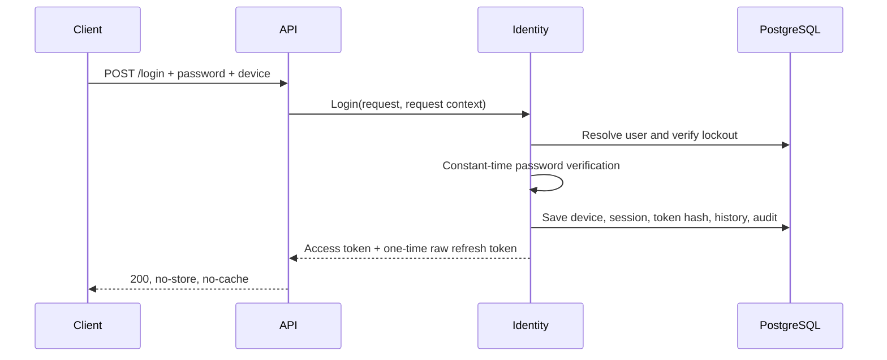

# Authentication and authorization — Phase 3

## Design

Identity Application owns framework-neutral contracts (`IPasswordHasher`, `ICurrentUser`, OTP contracts, request/response models, and the authentication service boundary). Identity Infrastructure owns cryptography, EF Core orchestration, token/session validation, and persistence. The API owns `HttpContext`, JWT bearer setup, dynamic authorization policies, rate-limit policies, Problem Details mapping, and thin endpoints. No endpoint accesses `IdentityDbContext`.

Passwords use the official .NET PBKDF2 implementation with SHA-256, a random per-password salt, configurable work factor, constant-time comparison, and a versioned self-describing encoding. A successful login transparently upgrades an older work factor. Passwords and their hashes are never logged.

Access tokens use signed HMAC-SHA256 JWTs and a 15-minute default lifetime. Validation requires the exact issuer, audience, signature, lifetime, and algorithm; unsigned and `alg=none` tokens are rejected. Tokens carry `sub`, `sid`, `jti`, `iat`, the security-stamp snapshot, user type, active roles, and active permissions. Each authenticated request validates the durable session and security-stamp snapshot, so logout and replay invalidation take effect immediately; this trades one narrow indexed query per authenticated request for deterministic revocation.

Refresh tokens contain 64 random bytes encoded as Base64Url. Only a SHA-256 hash is persisted. Rotation inserts the replacement and conditionally consumes the predecessor in one database transaction. A concurrent loser or any reuse revokes active tokens in the family/session, revokes the session, records replay detection, and returns only the generic `auth.refresh_token_invalid` error. Refresh is intentionally not idempotent because safely replaying a successful response would require caching a raw secret.

Permissions are embedded in the short-lived access token using ordinal comparison. Dynamic policies use `Permission:<permission-name>` and deny by default. Permissions never bypass resource ownership: the application service scopes session revocation to the current user. Logout, logout-all, session revoke, and OTP creation require an `Idempotency-Key`; records contain only hashed keys/fingerprints and never cache tokens or OTP values.

OTP codes are generated with `RandomNumberGenerator`, bound to challenge and device, HMAC-SHA256 hashed with a configured pepper, limited by attempts and expiry, and consumed with a conditional atomic update. The Development provider performs no external delivery and exposes the code only in the development/test response. It cannot be enabled in Production. No production delivery provider is included; with the development provider disabled, challenge creation returns `503 auth.otp_delivery_unavailable` before persisting a challenge.

ASP.NET Core fixed-window policies cover login, refresh, and OTP endpoints. A request-aware limiter after model binding adds per-operation partitions derived from normalized identifier/destination, token hash orchallenge ID, IP, purpose, and body device identifier. Every partition key is SHA-256 hashed, and the outer middleware also partitions by IP, session, and `X-Device-Identifier`. Responses use 429 and `Retry-After`. Account lockout remains an independent defense with five failed attempts and a 15-minute default lock.

Security audit records are append-only and contain event/category identifiers, actor/session/device identifiers, correlation ID, bounded user agent, IP, and UTC timestamp. Passwords, tokens, OTP values, authorization headers, request bodies, signing keys, and connection strings are excluded. Token responses set `Cache-Control: no-store` and `Pragma: no-cache`. All responses set `X-Content-Type-Options: nosniff` and `Referrer-Policy: no-referrer`; HSTS is enabled only in Production. CSP is omitted because the service is an API and serves no application UI.

## Flows



```mermaid
sequenceDiagram
    participant C as Client
    participant I as Identity
    participant D as PostgreSQL
    C->>I: POST /refresh + raw token + device
    I->>D: Lookup SHA-256 token hash
    I->>D: Begin transaction; insert replacement hash
    I->>D: Conditional consume old token
    alt exactly one row updated
        I->>D: Commit rotation and audit
        I-->>C: New access + refresh tokens
    else reused or concurrent loser
        I->>D: Roll back replacement
        I->>D: Revoke family/session and audit replay
        I-->>C: 401 generic error
    end
```

```mermaid
sequenceDiagram
    participant C as Client
    participant A as API
    participant I as Identity
    participant D as PostgreSQL
    C->>A: POST /logout + Idempotency-Key
    A->>I: Trusted sub/sid claims
    I->>D: Verify ownership; revoke session and token hashes
    I->>D: Persist idempotency and audit
    I-->>C: 200 (also for a matching duplicate)
```

```mermaid
sequenceDiagram
    participant C as Client
    participant I as Identity
    participant D as PostgreSQL
    C->>I: Create OTP challenge + Idempotency-Key
    I->>I: Generate code; HMAC with pepper + challenge ID
    I->>D: Store hash, expiry, attempts, device binding
    I-->>C: Challenge metadata (dev/test code only)
    C->>I: Verify code
    I->>D: Atomic conditional mark-used
    alt first valid attempt
        I-->>C: 200
    else replay, invalid, expired, or exhausted
        I-->>C: 401 stable error code
    end
```

## Operations

Required configuration is documented in the root README. Run migrations and verification from the repository root:

```powershell
dotnet tool restore
dotnet ef database update --project src/Modules/Identity/AlSsareea.Modules.Identity.Infrastructure --context IdentityDbContext
dotnet ef migrations has-pending-model-changes --project src/Modules/Identity/AlSsareea.Modules.Identity.Infrastructure --context IdentityDbContext
dotnet test --no-build
```

Migrations are not applied by API startup. Production secrets belong in environment variables or an external secret manager, never in source control.

## Out of scope

There is no production OTP transport, registration/onboarding, social login, full MFA, password-reset workflow, administrator account seed, or administrative user-management API. Permission seeds are not added because the repository has no established production seed orchestrator; deployment/operator provisioning must create and assign the documented Identity permissions before permission-protected endpoints are usable.
