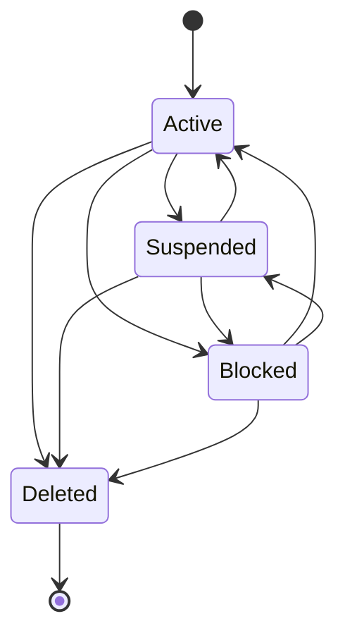

# Customers architecture

Phase 4 adds a framework-neutral Customer aggregate, application contracts, an EF Core/PostGIS infrastructure implementation, and versioned minimal APIs. It follows the same four-project module boundary as Identity and introduces no CQRS, mediator, validator, repository, event bus, or telemetry framework.

## Status lifecycle

No-op transitions are rejected. Suspended, Blocked, and Deleted transitions require a reason. Every accepted transition appends one history row in the same local database transaction. Customer commercial state never changes Identity account or session state.

## API matrix

| Method | Route | Access |
|---|---|---|
| POST | `/api/v1/customers/me` | Authenticated owner |
| GET/PUT | `/api/v1/customers/me` | Authenticated owner |
| GET/POST | `/api/v1/customers/me/addresses` | Authenticated owner |
| GET/PUT/DELETE | `/api/v1/customers/me/addresses/{addressId}` | Authenticated owner; foreign resources return 404 |
| PUT | `/api/v1/customers/me/addresses/{addressId}/default` | Authenticated owner |
| GET/PUT | `/api/v1/customers/me/preferences` | Authenticated owner |
| GET | `/api/v1/admin/customers` | `customers.customers.read` |
| GET | `/api/v1/admin/customers/{customerId}` | `customers.customers.read` |
| PUT | `/api/v1/admin/customers/{customerId}` | `customers.customers.update` |
| PUT | `/api/v1/admin/customers/{customerId}/status` | `customers.status.manage` |
| GET | `/api/v1/admin/customers/{customerId}/status-history` | `customers.history.read` |
| GET | `/api/v1/admin/customers/{customerId}/addresses` | `customers.addresses.read` |

Write requests carry the last observed concurrency stamp. A mismatch or EF concurrency conflict produces 409 Problem Details. Validation failures produce 400, concealed/missing resources 404, missing authentication 401, missing permissions 403, and rate-limit rejection 429.

## Tests

Domain tests cover profile rules, status history, terminal deletion, coordinate ranges, preferences, concurrency stamps, and default-address replacement. PostgreSQL/PostGIS tests cover migration metadata, schema isolation, constraints, query filters, spatial round trips/SRID, append-only enforcement, and real concurrency. Architecture tests protect dependency direction and prohibit Customers-to-Identity Infrastructure references.
