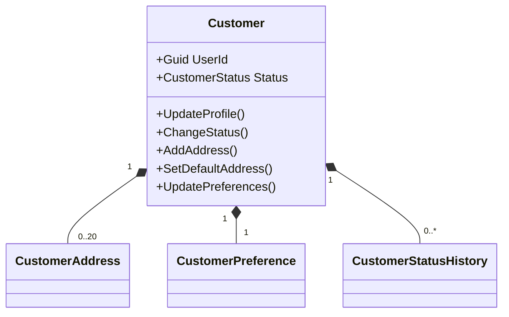

# Customers module

Customers is the authoritative owner of customer business profiles, commercial status, addresses, delivery instructions, preferences, and status history. Identity remains the exclusive owner of accounts, credentials, contact details, verification, roles, permissions, devices, sessions, and tokens.

The only Identity link is the scalar `Customer.UserId`. There is no EF navigation, database foreign key, direct Identity query, or shared transaction between the schemas.

## Aggregate

`Customer` is the sole aggregate root. `CustomerAddress`, `CustomerPreference`, and `CustomerStatusHistory` can only change through aggregate operations. A profile starts `Active` with Arabic (`ar`) and ILS preferences. `Suspended`, `Blocked`, and `Deleted` require reasons; `Deleted` is terminal.

The first active address is always default. Selecting another default clears the previous one atomically. Deleting the default selects the oldest remaining active address by `CreatedAtUtc`, then `Id`; deleting the final address leaves no default. Soft-deleted addresses are hidden by the normal EF query filter.

All mutable records use a GUID concurrency stamp configured as an EF concurrency token. Status history is append-only, and the context rejects modification or deletion. Customer status changes and their history append share one `SaveChanges` transaction.

## Persistence

`CustomersDbContext` owns PostgreSQL schema `customers`, migration history `customers.__ef_migrations_history`, and:

- `customers`
- `customer_addresses`
- `customer_preferences`
- `customer_status_history`

Address location is an optional PostGIS `geometry(point,4326)` where longitude is X and latitude is Y. A GIST index supports later spatial queries. A partial unique index on active default addresses is the final safeguard for the aggregate invariant. All child foreign keys use `RESTRICT`; no foreign key targets `identity`.

## Authorization

Self-service endpoints derive the owner from the authenticated `sub` claim and never accept a user ID. An address outside that profile is concealed as 404. Administrative endpoints use dynamic permission policies:

- `customers.customers.read`
- `customers.customers.update`
- `customers.status.manage`
- `customers.addresses.read`
- `customers.addresses.manage`
- `customers.history.read`

Status-change actors come from the current principal, not request content. Delivery instructions and coordinates are not written to application logs.

## Operational notes

Customers reuses the API Problem Details, correlation, authentication, permission-policy, rate-limiting, health-check, logging, and OpenAPI infrastructure. The repository has no reusable cross-module idempotency or audit subsystem: creation idempotency is therefore provided by the unique `user_id` constraint, while customer audit fields and append-only status history record business changes. Domain events remain in-process records because no dispatcher/outbox exists yet.

Geocoding, reverse geocoding, routing, distance, ETA, zones, service areas, and map-provider integration are explicitly deferred.
